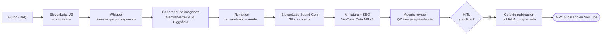

# Video Explainer IA 🎬

**Pipeline de producción automatizado que convierte un guion de texto en un vídeo explicativo
de YouTube completo** — voz sintética, imágenes generadas por IA sincronizadas frase a frase,
efectos de sonido, música, miniatura y metadata SEO, todo orquestado en código.

No es un prototipo de un fin de semana: es un sistema en producción activa, con **múltiples
vídeos reales publicados**, que ha ido evolucionando a base de resolver problemas concretos de
sincronización, coste y fiabilidad de APIs de terceros — documentados abajo en detalle.

---

## Qué demuestra este proyecto

- **Orquestación de múltiples APIs de IA en un pipeline con estado**: voz (ElevenLabs), imagen
  (Higgsfield + Gemini/Vertex AI), transcripción (Whisper), todo coordinado con checkpoints
  reanudables (`state.json`) para no perder trabajo si una API falla a mitad de una tanda grande.
- **Ingeniería de sincronización audio/vídeo real**: timestamps por segmento de Whisper mapeados
  a frames de Remotion, con corrección de `playbackRate`, detección de colisiones de nombres de
  fichero y descarte automático de alucinaciones de Whisper en el silencio final del audio.
- **Ingeniería de costes**: comparativa y migración en caliente de motor de generación de imágenes
  (de Higgsfield a Gemini vía Vertex AI) para aprovechar crédito cloud existente, incluyendo la
  resolución de un problema de autenticación no trivial (Gemini Developer API vs. Vertex AI con
  Application Default Credentials, sin necesidad de descargar credenciales JSON).
- **Generación de contenido guiada por reglas de estilo**: prompts de imagen con reglas anti-texto-
  en-inglés y anti-diagramas-genéricos para forzar consistencia visual de marca en un modelo
  generativo que por defecto no la respeta.
- **Automatización de publicación con control de calidad y HITL**: metadata SEO (título,
  descripción, capítulos calculados desde timestamps reales, tags) generada directamente desde
  la receta del vídeo y volcada a la subida sin copiar/pegar a mano; un agente revisor automático
  (`/video-reviewer`) hace QC de consistencia imagen/guion y sincronía de audio antes de que el
  humano dé el único visto bueno para publicar.
- **Publicación programada nativa, sin cron.** Cola de publicación (`publish_queue.py`) que
  reserva un hueco diario y sube el vídeo ya con `publishAt` fijado — YouTube lo hace público él
  solo a esa hora exacta, sin depender de ningún proceso corriendo en ese momento.
- **Aislamiento de credenciales multi-canal/multi-colaborador**: cada canal/colaborador configura
  su propio proyecto de Google Cloud + cliente OAuth (modo Testing, usuario de prueba propio),
  documentado paso a paso para que un equipo con varios canales no comparta credenciales entre
  cuentas de Google distintas.
- **Degradación controlada ante fallos de proveedor de IA, sin bloquear la entrega.** Cuando un
  modelo de imagen premium se queda sin cuota a mitad de tanda (ver más abajo), el pipeline no se
  detiene: cae a un motor alternativo para completar el vídeo y lo deja explícitamente marcado en
  el informe de revisión — nunca oculta una degradación de calidad al usuario final.

---

## Arquitectura del pipeline



Cada flecha es un paso reanudable de forma independiente — si se agotan los créditos de la API de
imágenes a mitad de 99 imágenes (ha pasado), el `state.json` guarda qué se generó y por dónde
retomar, sin repetir trabajo ya pagado.

---

## Stack técnico

| Capa | Herramienta | Por qué |
|---|---|---|
| 🎙️ Voz | **ElevenLabs V3** | Síntesis con control de emoción por etiquetas `[tono ...]` inline |
| ⏱️ Timestamps | **Whisper** (faster-whisper) | Segmentación por pausas reales, no por palabra suelta |
| 🎨 Imágenes | **Gemini 2.5/3 Pro Image (Vertex AI)** + **Higgsfield** | Motor dual — Vertex AI por coste, Higgsfield como fallback |
| 🔊 Audio | **ElevenLabs Sound Generation** | SFX puntuales + música de fondo en loop |
| 🎬 Montaje | **Remotion** (React + TypeScript) | Composición de vídeo declarativa, render programático |
| 📊 Publicación | **YouTube Data API v3** | Subida, SEO, subtítulos, packaging de canal, `publishAt` programado — todo sin YouTube Studio manual |
| 🔍 QC | Skill de revisión propia (`/video-reviewer`) | Muestreo visual + estructural antes del único gate humano de publicación |

---

## Estructura del repo

```
├── videos.json              ← registro de vídeos (composición, naming, playback rate, rutas)
├── scripts/
│   ├── config.py                 ← config central: lee .env, única fuente de verdad
│   ├── orchestrate.py            ← encadena el pipeline, guarda progreso en state.json
│   ├── generate_voice.py         ← ElevenLabs TTS
│   ├── generate_images.py        ← Higgsfield (motor legacy)
│   ├── generate_images_gemini.py ← Gemini vía Vertex AI (motor por defecto)
│   ├── generate_sfx.py           ← ElevenLabs Sound Generation
│   ├── generate_subs.py          ← subtítulos/txt limpio desde frames.json
│   ├── whisper_timestamps.py     ← timestamps + resegmentación por huecos de silencio
│   └── validate_assets.py        ← valida que audio + todas las imágenes existen antes de renderizar
├── remotion/
│   └── src/                      ← una composición .tsx por vídeo, registradas en Root.tsx
├── channel/<canal>/videos/<video>/
│   └── script.md · frames.json · sfx.json · seo.md · state.json · subs.txt   ← la "receta" versionada
├── scratch-yt/
│   ├── upload_youtube.py        ← subida + thumbnail + subtítulos, con --publish-at programado
│   ├── publish_queue.py         ← cola diaria de publicación (un vídeo/día a hora fija)
│   ├── publish_from_recipe.py   ← parsea seo.md y publica sin copiar/pegar metadata a mano
│   └── GUIA-COLABORADOR-YOUTUBE.md  ← setup de credenciales propio por canal/colaborador
├── .claude/skills/video-reviewer/   ← QC automático post-render antes del HITL de publicación
└── agentic-channel-analytics/    ← generación de guiones + auditoría de canal basada en un benchmark
```

---

## Arranque rápido

```bash
git clone https://github.com/Fernanditokitkatgr/video-explainer-ia-workflow.git
cd video-explainer-ia-workflow

pip install -r requirements.txt
cp .env.example .env              # rellena tus claves (ver .env.example, todo documentado)
cd remotion && npm install && cd ..
```

Generar un vídeo completo desde un guion existente:

```bash
python scripts/orchestrate.py --video sueno-stick --status     # ¿dónde se quedó?
python scripts/orchestrate.py --video sueno-stick               # pipeline completo con checkpoints
```

Detalle completo de cada paso: [VIDEO_EXPLAINER_WORKFLOW.md](./VIDEO_EXPLAINER_WORKFLOW.md).

---

## Problemas de ingeniería resueltos (no solo "until it works")

Una selección de los más representativos — el resto está documentado en detalle en `CLAUDE.md`:

- **Desincronización audio/imagen silenciosa.** Si falta una sola imagen en la secuencia, el
  lookup por timestamp desplaza *todos* los frames posteriores +1 sin que el render falle — hay
  que validar el set completo de assets antes de montar, nunca asumir que "si renderizó, está bien".
- **Whisper fusiona frases si el guion no tiene pausas claras.** Con frases largas y comas, dos o
  tres frases del guion colapsan en un solo segmento de Whisper. Solución: resegmentación por
  huecos de silencio a nivel de palabra (`--resegment-gap`), no por agrupación nativa de Whisper.
- **Whisper alucina un segmento fantasma sobre el silencio final del audio** (texto sin sentido
  gramatical) — hay que comparar el nº de segmentos reales contra las frases del guion y descartar
  la cola que no encaja, antes de gastar una generación de imagen en ella.
- **Migración de motor de imágenes en caliente sin perder calidad de marca.** Al mover la
  generación de Higgsfield a Gemini/Vertex AI para aprovechar crédito cloud, apareció un 401
  (`ACCESS_TOKEN_TYPE_UNSUPPORTED`) — diagnosticado como incompatibilidad de tipo de credencial
  (API key de cuenta de servicio vs. la que exige la Developer API), resuelto con Application
  Default Credentials en vez de una clave suelta, sin necesidad de descargar ningún JSON de
  cuenta de servicio.
- **`gemini-3-pro-image-preview` daba 404 en Vertex AI pese a tener acceso al proyecto** — no era
  un problema de permisos sino de *región*: ese modelo en concreto solo responde en
  `location=global`, no en regiones concretas (`us-central1`, etc.), algo no documentado de forma
  obvia y que generó horas de debugging en foros oficiales de Google antes de aislarlo por
  eliminación sistemática de variables (proyecto ✓, billing ✓, API habilitada ✓, modelo visible en
  Model Garden ✓ → solo quedaba la región).
- **Colisión de nombres de fichero por redondeo de timestamp.** Dos segmentos distintos pueden
  redondear al mismo `M_SS.jpg` (ej. `134.16s` y `134.96s` → ambos `2_14.jpg`), sobrescribiendo en
  silencio una imagen ya generada y pagada — deduplicación automática con sufijo tras cada
  resincronización.
- **Cuota de un modelo premium agotada a media tanda, en las 4 regiones a la vez.** Generando 70
  imágenes con `gemini-3-pro-image-preview`, la 36ª empezó a devolver 404 en `global`,
  `us-central1`, `us-east5` y `europe-west4` simultáneamente — no era el gotcha de región ya
  conocido (eso daba 404 solo en regiones concretas), sino cuota de proyecto agotada para ese
  modelo preview en concreto. Se resolvió completando el resto con el motor secundario (Flash) en
  vez de bloquear la entrega, dejándolo explícito en el informe de revisión — nunca se mezclan
  motores en silencio sin decírselo a quien decide publicar.
- **`captions.insert` (subtítulos) da 403 `insufficientPermissions` con el scope `youtube` que
  basta para subir vídeo/miniatura.** Necesita además `youtube.force-ssl` — un scope separado no
  documentado de forma obvia junto al resto de operaciones de `videos.insert`, hace falta
  reautenticar con ambos scopes a la vez si el token ya existía solo con el primero.

---

## Coste por vídeo

| Recurso | Coste aprox. |
|---|---|
| ElevenLabs (voz + SFX) | ~€0,40–1 |
| Imágenes — Gemini 2.5 Flash (Vertex AI) | ~€0,04/imagen · ~62 img/vídeo → ~€2,4 |
| Imágenes — Gemini 3 Pro (Vertex AI) | ~€0,13/imagen · ~62 img/vídeo → ~€8,3 |
| Imágenes — Higgsfield (`nano_banana_pro`) | ~€5,6 (140 créditos, plan Ultra) |
| Remotion | €0 (open-source, self-hosted) |

Con crédito cloud de bienvenida, el motor Gemini Flash estira el presupuesto a **~90-100 vídeos**;
el motor Pro (mayor fidelidad de composición) da para **~25-30 vídeos** con la misma cantidad.

---

## Documentación adicional

- [VIDEO_EXPLAINER_WORKFLOW.md](./VIDEO_EXPLAINER_WORKFLOW.md) — guía paso a paso del proceso completo
- [SETUP.md](./SETUP.md) — arranque detallado y uso del orquestador
- [CLAUDE.md](./CLAUDE.md) — bitácora técnica completa: convenciones, gotchas, decisiones de arquitectura
